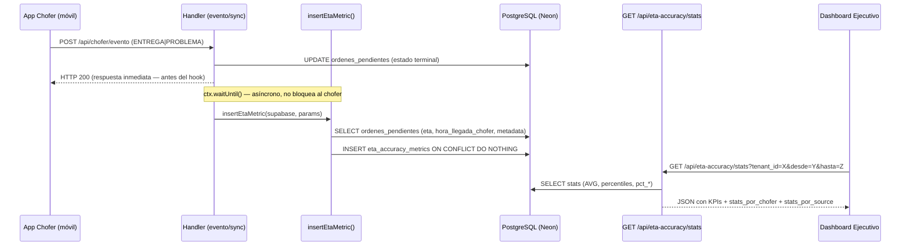

# Design Document — ETA Accuracy Metrics

## Overview

El sistema `eta-accuracy-metrics` implementa un pipeline de captura, persistencia y análisis de la precisión de ETAs a nivel de parada individual. Cada vez que una entrega llega a un estado terminal (ENTREGADO o RECHAZADO), el sistema calcula la diferencia entre el ETA predicho por el optimizador y la hora real de llegada del chofer, persiste ese dato con contexto enriquecido, y lo expone vía API de estadísticas para consumo por el dashboard ejecutivo.

La arquitectura se integra dentro del Worker existente (Cloudflare Workers + Neon/PostgreSQL vía Hyperdrive) sin introducir nuevas dependencias de infraestructura. El cambio es aditivo: dos handlers existentes reciben un hook de inserción asíncrona, se crea una tabla nueva, un nuevo endpoint de API, y una sección nueva en el dashboard ejecutivo HTML.

**Objetivos de diseño:**
- Zero-latency para el chofer: la persistencia es asíncrona vía `ctx.waitUntil()` — el handler padre retorna inmediatamente y la inserción ocurre en segundo plano sin bloquear la respuesta HTTP
- Helper compartido `insertEtaMetric()` para eliminar duplicación entre `app-chofer-evento.js` y `app-chofer-sync.js`
- Queries SQL con percentiles calculados en la base de datos (window functions) para eficiencia en datasets grandes
- Preparación para analítica futura: campos de contexto (`eta_source`, `optimization_run_id`, `eta_confidence`, `distancia_restante_km`, `stop_sequence`, `zona`) desde el primer día

---

## Architecture

### Flujo de Datos



### Módulos y Responsabilidades

```
src/
├── api/
│   ├── app-chofer-evento.js     ← MODIFICADO: agrega llamada a insertEtaMetric()
│   ├── app-chofer-sync.js       ← MODIFICADO: agrega llamada a insertEtaMetric() + ctx param
│   ├── optimizer.js             ← MODIFICADO: genera optimization_run_id por corrida
│   ├── eta-accuracy.js          ← NUEVO: endpoint GET /api/eta-accuracy/stats
│   └── dashboard-executive.js   ← MODIFICADO: agrega sección ETA_Dashboard_Section
├── helpers/
│   └── eta-metric.js            ← NUEVO: función helper insertEtaMetric() compartida
├── monitoring/
│   └── dashboard-executive.js   ← MODIFICADO: UI HTML con sección de precisión ETA
└── index.js                     ← MODIFICADO: registrar ruta /api/eta-accuracy/stats
migrations/
└── 003_eta_accuracy_metrics.sql ← NUEVO: DDL de la tabla e índices
```

### Decisiones de Diseño

**D1 — Helper compartido vs. duplicación inline**: En lugar de duplicar la lógica de inserción en `app-chofer-evento.js` y `app-chofer-sync.js`, se extrae a `src/helpers/eta-metric.js`. Esto sigue el patrón del proyecto y evita divergencias silenciosas.

**D2 — Conexión de BD en el helper**: El helper recibe el cliente `supabase` ya instanciado del handler padre, para reutilizar la conexión existente sin abrir una nueva. Para la query de percentiles en el endpoint de stats, se usa `pg.Client` (vía Hyperdrive) igual que `dashboard-executive.js`, porque Supabase JS SDK no soporta window functions directamente.

**D3 — Inserción asíncrona vía `ctx.waitUntil()` *(decisión revisada)***: La persistencia de la métrica ETA es ajena al flujo crítico del chofer — no hay razón para que el chofer espere a que un insert de analítica complete. El handler padre invoca `ctx.waitUntil(insertEtaMetric(...))` en lugar de `await insertEtaMetric(...)`. Esto garantiza zero-latency: la respuesta HTTP al chofer se retorna inmediatamente, y la inserción ocurre en el background del runtime de Cloudflare Workers. El helper `insertEtaMetric` sigue siendo una función async normal; el cambio es exclusivamente en el sitio de llamada en `app-chofer-evento.js` y `app-chofer-sync.js`. Cloudflare Workers garantiza que el callback de `waitUntil` se ejecuta hasta completar incluso tras enviar la respuesta. Si el insert falla, la respuesta al chofer no se ve afectada (absorción de errores).

**D4 — `ON CONFLICT DO NOTHING` vs. manejo de error**: La constraint `UNIQUE (tenant_id, stop_id)` se maneja con `ON CONFLICT DO NOTHING` directamente en el INSERT SQL, en lugar de capturar el error de duplicado. Esto es más eficiente y elimina race conditions.

**D5 — Percentiles en SQL, no en JS**: Los percentiles (p50, p90, p95, p99) se calculan con `PERCENTILE_CONT(0.X) WITHIN GROUP (ORDER BY error_absoluto_minutos)` en PostgreSQL. No se cargan todos los registros a JS para calcularlos. Esto es crítico para el requisito de rendimiento con 100k+ registros.

**D6 — `fecha` calculada en la query de inserción**: En lugar de calcularla en JS (que correría en UTC del servidor), la fecha se calcula en el INSERT con `(hora_real_llegada AT TIME ZONE 'America/Santiago')::date`. Esto garantiza la zona horaria correcta independientemente del timezone del Worker.

**D7 — `optimization_run_id`: UUID por corrida formal del optimizer**: El `optimization_run_id` identifica exclusivamente una corrida del optimizer principal (`optimizer.js`). Se genera una sola vez al inicio de `optimizarRutas()` con `crypto.randomUUID()` y se propaga a **todas** las órdenes generadas en esa corrida mediante `metadataObj.routing.optimization_run_id`. Formato: `OPT-${crypto.randomUUID()}` (e.g., `OPT-550e8400-e29b-41d4-a716-446655440000`).

Los recálculos de ETA posteriores (SALIDA, haversine en cascada) **no reciben** `optimization_run_id` — son eventos de actualización operativa, no corridas de optimización. El campo queda null para: rutas rápidas (`quick-route.js`), recálculos post-SALIDA, y cualquier ETA no generado por el optimizer formal. Esto garantiza que comparar `optimization_run_id` en `eta_accuracy_metrics` equivale estrictamente a comparar precisión entre corridas del optimizer.

---

## Components and Interfaces

### 1. `insertEtaMetric(supabase, params)` — Helper compartido

**Archivo**: `src/helpers/eta-metric.js`

**Contrato de entrada** (`params`):
```javascript
{
  tenant_id:   string,          // obligatorio
  stop_id:     string,          // obligatorio — clave única junto con tenant_id
  trip_id:     string | null,
  chofer_id:   string | null,   // del payload o fallback desde orden.chofer_asignado_id
  orden:       object,          // fila de ordenes_pendientes con: eta, hora_llegada_chofer, hora_real, metadata, chofer_asignado_id, stop_sequence
  hora_evento: string,          // ISO timestamp del evento (último fallback para hora_real_llegada)
}
```

**Tabla de confianza por fuente** (constante interna):

> **Nota de evolución:** En la versión actual, `eta_confidence` es un valor heurístico estático asignado por fuente de algoritmo. En versiones futuras, este valor podrá evolucionar hacia un score calculado dinámicamente a partir de la precisión histórica real de cada fuente (e.g., `1 - percentil_90_historico / umbral_referencia`), derivado de los propios datos de `eta_accuracy_metrics`. La columna persistida permite comparar "confianza prometida" vs "precisión real obtenida" como dos métricas distintas.

```javascript
const ETA_CONFIDENCE_MAP = {
  MAPBOX_TRAFFIC:     0.90,  // GPS activo + tráfico en tiempo real
  OPTIMIZER_STATIC:   0.70,  // ETA inicial sin recálculo posterior
  HAVERSINE_CASCADE:  0.55,  // Haversine con GPS — distancia exacta, velocidad estimada
  NO_GPS_FALLBACK:    0.20,  // Sin GPS — fallback de 20min fijo
  NO_COORDS_FALLBACK: 0.15,  // Sin coords del destino — fallback más precario
  // Fuente desconocida o null → null (sin score)
};
```

**Lógica interna (pseudocódigo)**:
```
1. eta_calculado = orden.eta → null → log skip + return
2. hora_real_llegada = orden.hora_llegada_chofer ?? orden.hora_real ?? hora_evento
3. Validar que ambos sean timestamps parseables → si no → log [ETA_METRIC_SKIP_INVALID_DATE] + return
4. error_minutos = ROUND((horaReal - etaCalc) / 60000, 1)
5. error_absoluto = ABS(error_minutos)
6. eta_source = orden.metadata?.routing?.eta_source ?? null
7. distancia_restante_km = orden.metadata?.routing?.km_al_siguiente ?? null
8. optimization_run_id = orden.metadata?.routing?.optimization_run_id ?? null
9. stop_sequence = orden.stop_sequence ?? null
10. zona = null  ← fase 1: no se puebla; se llenará en fase 2 con lookup geográfico
11. eta_confidence = ETA_CONFIDENCE_MAP[eta_source] ?? null
12. INSERT INTO eta_accuracy_metrics (...) VALUES (...) ON CONFLICT (tenant_id, stop_id) DO NOTHING
13. catch: 42P01 → log [ETA_METRIC_TABLE_MISSING]; else → log [ETA_METRIC_ERROR]; siempre return
```

### 2. Modificaciones a `app-chofer-evento.js`

El handler pasa `ctx` al scope y envuelve la llamada al helper en `ctx.waitUntil()`. La respuesta HTTP al chofer se retorna **antes** de que el INSERT ocurra:

```javascript
import { insertEtaMetric } from '../helpers/eta-metric.js';

// En el bloque ENTREGA, después del UPDATE exitoso:
const { data: ordenParaMetrica } = await supabase
  .from('ordenes_pendientes')
  .select('eta, hora_llegada_chofer, hora_real, metadata, chofer_asignado_id, stop_sequence')
  .eq('ot_id', stop_id).eq('tenant_id', tenant_id).single();

// ctx.waitUntil: el chofer recibe 200 inmediatamente; la métrica se persiste en background
ctx.waitUntil(insertEtaMetric(supabase, {
  tenant_id, stop_id, trip_id,
  chofer_id: payload.chofer_id ?? null,
  orden: ordenParaMetrica,
  hora_evento: timestamp,
}));

return jsonRes({ exito: true, mensaje: 'Entrega confirmada con POD inmutable.' });
```

### 3. Modificaciones a `app-chofer-sync.js`

Equivalente, después del UPDATE de estado para `COMPLETADA` y `PROBLEMA`. Notar que `syncChoferEvent` no recibe `ctx` actualmente — se deberá agregar como tercer parámetro del handler:

```javascript
import { insertEtaMetric } from '../helpers/eta-metric.js';

// export async function syncChoferEvent(request, env, ctx) { ← agregar ctx
const { data: ordenParaMetrica } = await supabase
  .from('ordenes_pendientes')
  .select('eta, hora_llegada_chofer, hora_real, metadata, chofer_asignado_id, stop_sequence')
  .eq('ot_id', stopId).eq('tenant_id', tenant_id).single();

ctx.waitUntil(insertEtaMetric(supabase, {
  tenant_id, stop_id: stopId, trip_id: ordenInfo.trip_id,
  chofer_id: null,
  orden: ordenParaMetrica,
  hora_evento: new Date().toISOString(),
}));
```

### 3b. Modificaciones a `optimizer.js`

Al inicio de `optimizarRutas()`, inmediatamente después de validar `tenant_id`, se genera el ID de la corrida:

```javascript
// Generado UNA sola vez por corrida completa del optimizer
// Se propaga a todas las órdenes de todos los viajes generados en este run
const optimizationRunId = `OPT-${crypto.randomUUID()}`;
// Ejemplo: "OPT-550e8400-e29b-41d4-a716-446655440000"
```

Este valor se incluye en el `metadataObj.routing` de **cada parada** de **cada viaje**:

```javascript
const metadataObj = {
    routing: {
        optimization_run_id: optimizationRunId,  // ← idéntico para todas las órdenes del run
        trip_id: asignacion.tripId,
        stop_sequence: stopSequence,
        eta_estimado: etaIso,
        // ...resto sin cambios
    }
};
```

**Reglas de null explícitas** — estos paths NO asignan `optimization_run_id`:
- Recálculo post-SALIDA en `app-chofer-evento.js` → campo ausente del patch → persiste como null
- `quick-route.js` → no es corrida formal del optimizer → sin el campo
- Cualquier ETA generado fuera del optimizer principal → null por defecto
```

### 4. `GET /api/eta-accuracy/stats` — Endpoint de estadísticas

**Archivo**: `src/api/eta-accuracy.js`

**Query parameters**: `tenant_id` (req), `desde` (YYYY-MM-DD), `hasta` (YYYY-MM-DD), `chofer_id`, `eta_source`, `optimization_run_id`

**Respuesta exitosa (HTTP 200)**:
```json
{
  "total_registros": 1240,
  "error_promedio_min": 4.2,
  "error_mediana_min": 3.1,
  "error_p90_min": 11.5,
  "error_p95_min": 18.3,
  "error_p99_min": 42.7,
  "error_absoluto_promedio_min": 5.8,
  "pct_dentro_5min": 61.3,
  "pct_dentro_10min": 78.4,
  "pct_dentro_15min": 89.2,
  "stats_por_chofer": [
    { "chofer_id": "42", "total_registros": 320, "error_absoluto_promedio_min": 4.1, "pct_dentro_10min": 85.0 }
  ],
  "stats_por_source": [
    { "eta_source": "MAPBOX_TRAFFIC", "total_registros": 890, "error_absoluto_promedio_min": 3.9, "error_p90_min": 9.2, "eta_confidence_promedio": 0.9 }
  ]
}
```

**Query SQL central** (via `pg.Client` con Hyperdrive):
```sql
SELECT
  COUNT(*)::int AS total_registros,
  ROUND(AVG(error_minutos)::numeric, 1) AS error_promedio_min,
  ROUND(PERCENTILE_CONT(0.50) WITHIN GROUP (ORDER BY error_absoluto_minutos)::numeric, 1) AS error_mediana_min,
  ROUND(PERCENTILE_CONT(0.90) WITHIN GROUP (ORDER BY error_absoluto_minutos)::numeric, 1) AS error_p90_min,
  ROUND(PERCENTILE_CONT(0.95) WITHIN GROUP (ORDER BY error_absoluto_minutos)::numeric, 1) AS error_p95_min,
  ROUND(PERCENTILE_CONT(0.99) WITHIN GROUP (ORDER BY error_absoluto_minutos)::numeric, 1) AS error_p99_min,
  ROUND(AVG(error_absoluto_minutos)::numeric, 1) AS error_absoluto_promedio_min,
  ROUND(100.0 * COUNT(*) FILTER (WHERE error_absoluto_minutos <= 5)  / NULLIF(COUNT(*),0), 1) AS pct_dentro_5min,
  ROUND(100.0 * COUNT(*) FILTER (WHERE error_absoluto_minutos <= 10) / NULLIF(COUNT(*),0), 1) AS pct_dentro_10min,
  ROUND(100.0 * COUNT(*) FILTER (WHERE error_absoluto_minutos <= 15) / NULLIF(COUNT(*),0), 1) AS pct_dentro_15min
FROM eta_accuracy_metrics
WHERE tenant_id = $1
  AND ($2::date IS NULL OR fecha >= $2::date)
  AND ($3::date IS NULL OR fecha <= $3::date)
  AND ($4::text IS NULL OR chofer_id = $4)
  AND ($5::text IS NULL OR eta_source = $5)
  AND ($6::text IS NULL OR optimization_run_id = $6);
```

### 5. Sección ETA en Dashboard Ejecutivo

Integrada en `src/monitoring/dashboard-executive.js`. Se carga la sección de KPIs de precisión ETA con coloración semáforo:

- `pct_dentro_10min >= 80` → verde (`#10b981`)
- `pct_dentro_10min` entre 60–79 → amarillo (`#f59e0b`)
- `pct_dentro_10min < 60` → rojo (`#ef4444`)
- `total_registros = 0` → texto `"Sin datos aún"` en gris

---

## Data Models

### Tabla: `eta_accuracy_metrics`

```sql
-- migrations/003_eta_accuracy_metrics.sql
BEGIN;

CREATE TABLE IF NOT EXISTS eta_accuracy_metrics (
  id                      BIGSERIAL      PRIMARY KEY,
  tenant_id               VARCHAR(64)    NOT NULL,
  trip_id                 VARCHAR(64)    NOT NULL,
  stop_id                 VARCHAR(64)    NOT NULL,
  chofer_id               VARCHAR(64),
  eta_calculado           TIMESTAMPTZ    NOT NULL,
  hora_real_llegada       TIMESTAMPTZ    NOT NULL,
  error_minutos           NUMERIC(8,1),
  error_absoluto_minutos  NUMERIC(8,1),
  eta_source              VARCHAR(32),
  distancia_restante_km   NUMERIC(8,2),
  optimization_run_id     VARCHAR(64),                        -- reemplaza route_version; ID del run del optimizer que generó el ETA
  stop_sequence           SMALLINT,                           -- posición de la parada en la ruta al momento de la entrega
  zona                    VARCHAR(64),                        -- comuna/zona geográfica — fase 1: siempre NULL; se puebla en fase 2
  eta_confidence          NUMERIC(3,2)   CHECK (eta_confidence IS NULL OR (eta_confidence >= 0.00 AND eta_confidence <= 1.00)),
  fecha                   DATE           NOT NULL,
  created_at              TIMESTAMPTZ    NOT NULL DEFAULT NOW(),

  CONSTRAINT uq_eta_metrics_tenant_stop UNIQUE (tenant_id, stop_id)
);

CREATE INDEX IF NOT EXISTS idx_eta_metrics_tenant_fecha    ON eta_accuracy_metrics (tenant_id, fecha DESC);
CREATE INDEX IF NOT EXISTS idx_eta_metrics_chofer_fecha    ON eta_accuracy_metrics (chofer_id, fecha DESC);
CREATE INDEX IF NOT EXISTS idx_eta_metrics_trip            ON eta_accuracy_metrics (trip_id);
CREATE INDEX IF NOT EXISTS idx_eta_metrics_source_fecha    ON eta_accuracy_metrics (eta_source, fecha DESC);
CREATE INDEX IF NOT EXISTS idx_eta_metrics_opt_run         ON eta_accuracy_metrics (optimization_run_id) WHERE optimization_run_id IS NOT NULL;

COMMIT;
```

**Descripción de campos**:

| Campo                    | Tipo         | Nullable | Fuente de datos |
|--------------------------|--------------|----------|-----------------|
| `eta_calculado`          | TIMESTAMPTZ  | No       | `ordenes_pendientes.eta` |
| `hora_real_llegada`      | TIMESTAMPTZ  | No       | `hora_llegada_chofer` → `hora_real` → timestamp evento |
| `error_minutos`          | NUMERIC(8,1) | Sí       | `(hora_real - eta) / 60000` ms→min, con signo |
| `eta_source`             | VARCHAR(32)  | Sí       | `metadata.routing.eta_source` |
| `distancia_restante_km`  | NUMERIC(8,2) | Sí       | `metadata.routing.km_al_siguiente` |
| `optimization_run_id`    | VARCHAR(64)  | Sí       | `metadata.routing.optimization_run_id` — ID del run del optimizer |
| `stop_sequence`          | SMALLINT     | Sí       | `ordenes_pendientes.stop_sequence` — posición en la ruta |
| `zona`                   | VARCHAR(64)  | Sí       | Fase 1: siempre NULL. Fase 2: lookup desde `clientes.comuna` |
| `eta_confidence`         | NUMERIC(3,2) | Sí       | `ETA_CONFIDENCE_MAP[eta_source]` — valor heurístico; evoluciona a histórico en v2 |
| `fecha`                  | DATE         | No       | `hora_real_llegada AT TIME ZONE 'America/Santiago'` |

---

## Correctness Properties

### Property 1: Cálculo Correcto de Error ETA
Para cualquier par de timestamps válidos `(eta_calculado, hora_real_llegada)`, `error_minutos = ROUND((horaReal - etaCalc) / 60000, 1)` y `error_absoluto_minutos = ABS(error_minutos)`. **Validates: Req 1.4, 1.5**

### Property 2: Unicidad de Parada por Tenant
Para cualquier `(tenant_id, stop_id)`, múltiples intentos de inserción resultan en exactamente un registro. Los duplicados no modifican el existente ni provocan errores HTTP al chofer. **Validates: Req 1.3, 2.7**

### Property 3: Omisión Correcta de Inserciones Inválidas
Si `eta_calculado` es null o cualquier timestamp no es parseable, no existe fila nueva en la tabla y la respuesta HTTP es 200. **Validates: Req 1.7, 2.6, 5.1**

### Property 4: Zona Horaria Correcta para `fecha`
Para cualquier `hora_real_llegada`, `fecha` es la fecha del timestamp en `America/Santiago`, no UTC. **Validates: Req 1.8, 5.4**

### Property 5: Prioridad de `hora_real_llegada`
La cascada `hora_llegada_chofer → hora_real → hora_evento` se respeta estrictamente; nunca se usa un fallback cuando el valor prioritario está disponible. **Validates: Req 2.5**

### Property 6: Mapeo Completo de `eta_confidence`
Para cualquier `eta_source`, `eta_confidence` corresponde exactamente a `ETA_CONFIDENCE_MAP`; fuentes desconocidas o null → null. **Validates: Req 2.13**

### Property 7: `optimization_run_id` Bien Formado
`optimization_run_id` se extrae de `metadata.routing.optimization_run_id`; si no está disponible → null. Nunca se construye artificialmente. **Validates: Req 2.12**

### Property 8: `stop_sequence` Persistido Correctamente
El valor de `stop_sequence` en el registro es exactamente `ordenes_pendientes.stop_sequence` al momento de la entrega, o null si no existe. **Validates: Req 1.1**

### Property 8: Extracción Correcta de Metadata
`eta_source` y `distancia_restante_km` son exactamente los valores en `metadata.routing.*`, o null si la ruta no existe. **Validates: Req 2.10, 2.11**

### Property 9: Corrección Estadística del Endpoint
`error_mediana_min ≤ error_p90_min ≤ error_p95_min ≤ error_p99_min`, `pct_5 ≤ pct_10 ≤ pct_15`, todos en [0,100], `error_absoluto_promedio ≥ 0`, cero registros → todo null. **Validates: Req 3.3, 3.4, 3.5, 3.6**

### Property 10: Filtros Restringen Correctamente
Aplicar `chofer_id`, `eta_source` o `route_version` produce resultados idénticos a calcular manualmente sobre el subconjunto filtrado. **Validates: Req 3.8, 3.12, 3.13**

### Property 11: Aislamiento Multi-Tenant
Registros de tenant A nunca aparecen en consultas de tenant B. **Validates: Req 5.3**

### Property 12: Preservación de Outliers
`error_absoluto_minutos > 480` se almacena sin modificación. **Validates: Req 5.2**

### Property 13: Coloración Correcta en Dashboard
`pct ≥ 80` → verde, `60 ≤ pct < 80` → amarillo, `pct < 60` → rojo. Los umbrales exactos (80, 60) se asignan a verde y amarillo respectivamente. **Validates: Req 4.3, 4.4, 4.5**

---

## Error Handling

| Condición | Acción en el hook | Impacto en el chofer |
|-----------|-------------------|---------------------|
| `eta` es null | Log skip + return | **Ninguno** — ya respondió HTTP 200 |
| Timestamp inválido | Log `[ETA_METRIC_SKIP_INVALID_DATE]` + return | **Ninguno** — ya respondió HTTP 200 |
| Duplicado UNIQUE | `ON CONFLICT DO NOTHING` | **Ninguno** — ya respondió HTTP 200 |
| Tabla no existe (`42P01`) | Log `[ETA_METRIC_TABLE_MISSING]` + return | **Ninguno** — ya respondió HTTP 200 |
| Cualquier otro error BD | Log `[ETA_METRIC_ERROR]` + return | **Ninguno** — ya respondió HTTP 200 |

> El hook corre dentro de `ctx.waitUntil()`: el chofer recibe HTTP 200 **antes** de que el INSERT comience. Cualquier fallo es completamente invisible para el chofer.

| Condición en la API de stats | Respuesta |
|-----------------------------|-----------|
| `tenant_id` ausente | HTTP 400 |
| Fecha inválida | HTTP 400 con campo específico |
| Error de BD | HTTP 500 |
| Sin datos | HTTP 200 con `total_registros: 0` |

---

## Testing Strategy

**Librería PBT**: `fast-check` — 100 iteraciones mínimas por propiedad.

**Archivos de test**:
- `src/helpers/eta-metric.test.js` — unit tests del helper
- `src/helpers/eta-metric.pbt.test.js` — property-based tests para Properties 1–13
- `src/api/eta-accuracy.integration.test.js` — tests de integración end-to-end

Cada PBT incluye el tag: `// Feature: eta-accuracy-metrics, Property N: <descripción>`
