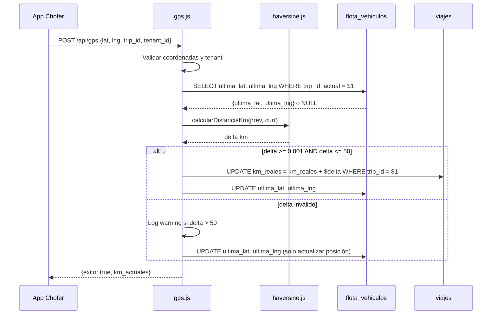

# Design Document: KPI KM Planificados vs Reales

## Overview

Este feature agrega el KPI de **KM Planificados vs KM Reales** al sistema OTIF Sentinel. El objetivo es medir la desviación entre la distancia calculada por el optimizer (`distancia_total_viaje_km` en `metadata.routing`) y la distancia real acumulada a partir de los pings GPS del chofer durante el viaje.

### Observación de diseño clave

Al analizar el código existente, se encontró que `src/api/gps.js` ya implementa una versión del acumulador GPS en la columna `flota_vehiculos.km_recorridos_reales`. Sin embargo, esta implementación:

- Tiene un umbral de 0.01 km (vs. el requerimiento de 0.001 km)
- No implementa el filtro de outlier de 50 km
- No valida rangos de coordenadas
- No registra warnings en el log
- No usa la tabla `viajes` sino `flota_vehiculos`

El diseño **no reemplaza** `km_recorridos_reales` de `flota_vehiculos` (ya lo usa el dashboard actual). En cambio, agrega una columna `km_reales` a la tabla `viajes` que es el campo canónico del KPI, y refactoriza la función haversine como utilidad compartida.

---

## Architecture

```mermaid
flowchart TD
    A[App del Chofer<br/>GPS Ping] --> B[/api/gps.js<br/>handleGPSPing]
    B --> C{Validate<br/>Coords + trip_id}
    C -->|inválido| D[Log warning, return]
    C -->|válido| E[haversine.js<br/>calcularDistanciaKm]
    E --> F{delta >= 0.001 km<br/>AND delta <= 50 km?}
    F -->|no| G[Actualizar solo<br/>ultima_lat/lng]
    F -->|sí| H[UPDATE viajes<br/>km_reales = km_reales + delta<br/>atómico SQL]
    H --> I[UPDATE flota_vehiculos<br/>ultima_lat, ultima_lng]
    G --> I

    J[Dashboard Polling<br/>getControlTowerViajesAPI] --> K[SQL Query extendida<br/>JOIN viajes ON trip_id]
    K --> L[Calcular km_planificados<br/>km_reales, desviacion_km_pct]
    L --> M[JSON Response<br/>con KPI fields]
    M --> N[ui.js<br/>renderKmKpiWidget]
    N --> O[Semáforo<br/>🔴🟢🟡]
```

### Flujo de datos GPS



---

## Components and Interfaces

### 1. `src/utils/haversine.js` (nuevo)

Función pura reutilizable extraída de las implementaciones dispersas en el código:

```javascript
/**
 * Calcula la distancia haversine entre dos puntos geográficos.
 * @param {number} lat1 - Latitud origen (-90 a 90)
 * @param {number} lon1 - Longitud origen (-180 a 180)
 * @param {number} lat2 - Latitud destino (-90 a 90)
 * @param {number} lon2 - Longitud destino (-180 a 180)
 * @returns {number} Distancia en kilómetros, redondeada a 2 decimales
 */
export function calcularDistanciaKm(lat1, lon1, lat2, lon2) { ... }

/**
 * Valida que las coordenadas sean números en rango válido.
 * @returns {boolean}
 */
export function sonCoordenadasValidas(lat, lng) { ... }
```

**Decisión de diseño**: Centralizar haversine elimina la triplicación actual en `optimizer.js`, `app-chofer-evento.js` y `gps.js`. La función retorna 2 decimales para consistencia con `NUMERIC(10,2)` en la BD.

### 2. `src/api/gps.js` (modificado)

Se refactoriza `handleGPSPing` para:
- Usar `haversine.js` importado
- Ajustar umbral mínimo de 0.01 → 0.001 km
- Agregar filtro de outlier: delta > 50 km → log warning + skip acumulación
- Mantener actualización de `flota_vehiculos.km_recorridos_reales` (retrocompatibilidad)
- **Agregar** update atómico de `viajes.km_reales`

```javascript
// Pseudocódigo del hook en handleGPSPing
const delta = calcularDistanciaKm(ultima_lat, ultima_lng, lat, lng);

if (delta > 50) {
  console.warn(`[GPS_OUTLIER] trip_id=${trip_id} delta=${delta.toFixed(2)}km`);
  // Solo actualiza posición, NO acumula
} else if (delta >= 0.001) {
  // Update atómico en viajes
  await client.query(
    `UPDATE viajes SET km_reales = km_reales + $1 WHERE trip_id = $2`,
    [delta, trip_id]
  );
}
// Siempre actualiza última posición en flota_vehiculos
```

### 3. `src/api/dashboard.js` — `getControlTowerViajesAPI` (modificado)

Se extiende la query SQL para hacer JOIN con `viajes` y calcular los tres campos KPI en el servidor:

```sql
SELECT
  o.trip_id,
  ...campos existentes...,
  -- KPI KM
  ROUND(
    CAST(MAX((o.metadata->'routing'->>'distancia_total_viaje_km')::NUMERIC) AS NUMERIC),
    1
  ) AS km_planificados,
  ROUND(CAST(COALESCE(vj.km_reales, 0) AS NUMERIC), 1) AS km_reales,
  CASE
    WHEN COALESCE(MAX((o.metadata->'routing'->>'distancia_total_viaje_km')::NUMERIC), 0) = 0
      THEN NULL
    WHEN COALESCE(vj.km_reales, 0) = 0
      THEN 0.0
    ELSE ROUND(
      ((COALESCE(vj.km_reales, 0) - MAX((o.metadata->'routing'->>'distancia_total_viaje_km')::NUMERIC))
       / MAX((o.metadata->'routing'->>'distancia_total_viaje_km')::NUMERIC)) * 100,
      1
    )
  END AS desviacion_km_pct
FROM ordenes_pendientes o
LEFT JOIN viajes vj ON o.trip_id = vj.trip_id
...
```

**Decisión de diseño**: Los cálculos se hacen en SQL para evitar transferir datos raw al Worker y computar en JS. El `ROUND(...NUMERIC)` evita problemas de precisión flotante.

### 4. `src/ui.js` — `renderKmKpiWidget` (nuevo helper)

Función pura que genera el HTML del widget KPI dado los datos de un viaje:

```javascript
/**
 * @param {number|null} kmPlanificados
 * @param {number|null} kmReales
 * @param {number|null} desviacionPct
 * @returns {string} HTML del widget
 */
export function renderKmKpiWidget(kmPlanificados, kmReales, desviacionPct) { ... }
```

El widget se inyecta en el `trip-subtitle` de cada card de viaje.

---

## Data Models

### Migración SQL

```sql
-- migrations/002_kpi_km_reales.sql
BEGIN;

-- Agregar columna km_reales a la tabla viajes
-- DEFAULT 0 garantiza que filas existentes no se rompen (Req 1.1, 1.3)
ALTER TABLE viajes
  ADD COLUMN IF NOT EXISTS km_reales NUMERIC(10, 2) DEFAULT 0;

-- Restricción para garantizar no-negatividad (Req 1.4)
ALTER TABLE viajes
  ADD CONSTRAINT viajes_km_reales_non_negative CHECK (km_reales >= 0);

-- Índice para queries de dashboard que filtran/ordenan por trip_id
-- (ya debe existir, pero se documenta como dependencia)
-- CREATE INDEX IF NOT EXISTS idx_viajes_trip_id ON viajes(trip_id);

COMMIT;
```

### Tabla `viajes` (campo nuevo)

| Columna | Tipo | Default | Constraint | Descripción |
|---|---|---|---|---|
| `km_reales` | `NUMERIC(10,2)` | `0` | `>= 0` | Kilómetros reales acumulados desde GPS pings |

### Tabla `flota_vehiculos` (sin cambios)

Se mantiene `km_recorridos_reales` existente para retrocompatibilidad con el dashboard HTML server-rendered. La columna `ultima_lat` / `ultima_lng` ya existe y se usa como estado del acumulador.

### Contratos de datos en la API

Respuesta extendida de `/api/dashboard/viajes`:

```json
{
  "exito": true,
  "viajes": [
    {
      "trip_id": "TRIP-ABC123",
      "chofer": "Juan Pérez",
      "km_planificados": 145.3,
      "km_reales": 162.1,
      "desviacion_km_pct": 11.6,
      "...": "...campos existentes..."
    }
  ]
}
```

Cuando no hay datos de routing: `km_planificados: null`, `desviacion_km_pct: null`.
Cuando el viaje recién empieza: `km_reales: 0`, `desviacion_km_pct: 0.0`.

---

## Correctness Properties

*Una propiedad es una característica o comportamiento que debe ser verdadero en todas las ejecuciones válidas del sistema — esencialmente, una afirmación formal sobre lo que el software debe hacer. Las propiedades sirven como puente entre especificaciones legibles por humanos y garantías de corrección verificables por máquinas.*

### Property 1: Haversine — simetría y no-negatividad

*Para cualquier* par de coordenadas válidas `(lat1, lng1)` y `(lat2, lng2)`, la función `calcularDistanciaKm` debe retornar un valor no-negativo, y `calcularDistanciaKm(A, B)` debe ser igual a `calcularDistanciaKm(B, A)` (simetría).

**Validates: Requirements 2.1, 2.6**

---

### Property 2: Accumulator — suma correcta de deltas válidos

*Para cualquier* secuencia de N coordenadas GPS consecutivas asociadas a un `trip_id`, donde cada delta entre puntos consecutivos está en el rango `[0.001, 50]` km, el valor de `km_reales` después de procesar toda la secuencia debe ser igual a la suma de todos los deltas individuales redondeados a 2 decimales.

**Validates: Requirements 2.2, 6.1**

---

### Property 3: Accumulator — inputs inválidos no modifican km_reales

*Para cualquier* combinación de (`km_reales` actual, GPS_Event con coordenadas inválidas), donde "inválido" significa: `null`, no-numérico, latitud fuera de `[-90, 90]`, longitud fuera de `[-180, 180]`, o delta resultante negativo, el Accumulator no debe modificar el valor de `km_reales`.

**Validates: Requirements 2.4, 1.4**

---

### Property 4: Posición GPS siempre refleja el último punto válido

*Para cualquier* secuencia de GPS_Events válidos sobre un `trip_id`, después de procesar toda la secuencia, los valores de `ultima_lat` y `ultima_lng` en `flota_vehiculos` deben ser iguales a las coordenadas del último evento válido procesado (independientemente de si ese evento incrementó `km_reales` o no, siempre que pasara validación de rango).

**Validates: Requirements 3.1, 3.2**

---

### Property 5: Motor de cálculo KPI — fórmula de desviación correcta

*Para cualquier* par `(km_reales, km_planificados)` donde `km_planificados > 0`, el valor de `desviacion_km_pct` calculado debe ser igual a `round(((km_reales - km_planificados) / km_planificados) * 100, 1)`. En particular: cuando `km_reales == km_planificados`, la desviación debe ser exactamente `0.0`.

**Validates: Requirements 4.4**

---

### Property 6: API contract — campos KPI siempre presentes en la respuesta

*Para cualquier* viaje retornado por `getControlTowerViajesAPI`, la respuesta debe contener los campos `km_planificados`, `km_reales` y `desviacion_km_pct`. El valor puede ser `null` solo cuando `km_planificados` es nulo o cero (ausencia de datos de routing), pero los campos siempre deben estar presentes como claves en el objeto.

**Validates: Requirements 4.1, 4.7**

---

### Property 7: Semáforo — clasificación correcta para cualquier valor de desviación

*Para cualquier* valor numérico de `desviacion_km_pct`, la función clasificadora debe retornar:
- `'red'` si `desviacion_km_pct > 10`
- `'green'` si `-10 <= desviacion_km_pct <= 10`
- `'yellow'` si `desviacion_km_pct < -10`

Y nunca retornar un valor distinto a esos tres.

**Validates: Requirements 5.2, 5.3, 5.4**

---

### Property 8: Widget render — formato de valores para cualquier número

*Para cualquier* número `n >= 0`, la función de formato de distancia debe retornar un string que termine en `' km'` y contenga exactamente un dígito decimal. *Para cualquier* número `n` (positivo, negativo o cero), la función de formato de desviación debe retornar un string que termine en `'%'`, tenga exactamente un dígito decimal, y contenga el signo `'+'` si `n > 0`, `'-'` si `n < 0`, y ningún signo si `n === 0.0`.

**Validates: Requirements 5.6, 5.7**

---

### Property 9: Widget render — nulls siempre producen "—"

*Para cualquier* combinación de valores donde al menos uno de `km_planificados`, `km_reales` o `desviacion_km_pct` sea `null`, la función de render del KPI widget debe incluir el string `"—"` en la posición correspondiente al campo nulo.

**Validates: Requirements 5.5**

---

## Error Handling

### GPS_Event inválido

| Condición | Comportamiento | Log |
|---|---|---|
| `lat`/`lng` null o no-numérico | Return 400, no tocar BD | No |
| Coordenadas fuera de rango | Return 400, no tocar BD | No |
| `trip_id` no existe en `viajes` | Return 404, no tocar BD | `[GPS_NO_TRIP]` |
| Delta > 50 km (outlier) | Actualizar posición, skip acumulación | `[GPS_OUTLIER] trip_id=X delta=Y.YYkm` |
| Error de BD en UPDATE | Return 500 | `[GPS_DB_ERROR]` + trip_id + delta |
| `km_reales` resultaría negativo | Constraint de BD lo rechaza → error atrapado | `[GPS_NEGATIVE_KM]` |

### Dashboard API

| Condición | Comportamiento |
|---|---|
| `km_planificados = 0` o `NULL` | `desviacion_km_pct: null` en respuesta |
| No hay viajes activos | Array vacío, status 200 |
| Error de BD | Status 500, `{exito: false, error: msg}` |

### Widget UI

| Condición | Comportamiento |
|---|---|
| Cualquier campo KPI es `null` | Mostrar `"—"` en ese campo |
| `desviacion_km_pct` fuera de rangos conocidos | Tratado como `> 10` → rojo (fail-safe) |

---

## Testing Strategy

### Dual Testing Approach

Se combinan tests de ejemplo (casos específicos) y tests basados en propiedades (cobertura amplia).

### Librería de Property-Based Testing

**`fast-check`** (npm) — compatible con Vitest y entornos ES Modules/Cloudflare Workers.

```bash
npm install --save-dev fast-check
```

### Configuración de property tests

- Mínimo **100 iteraciones** por test de propiedad
- Tag de referencia en cada test: `// Feature: kpi-km-planificados-vs-reales, Property N: <texto>`

### Tests unitarios (example-based)

```
src/utils/haversine.test.js
  ✓ Req 2.6: distancia Santiago-Valparaíso ≈ 110 km
  ✓ Req 2.3: primera posición no acumula km
  ✓ Req 2.7: trip_id inexistente es ignorado
  ✓ Req 3.3: viaje finalizado no actualiza posición tras cierre
  ✓ Req 6.2: GPS event post-cierre no modifica km_reales
  ✓ Req 6.4: fallo de BD loggea error y no deja estado parcial

src/api/gps.test.js
  ✓ Smoke: columna km_reales existe con DEFAULT 0 post-migración
  ✓ Req 1.2: viaje nuevo tiene km_reales = 0
  ✓ Req 4.5: km_planificados = 0 → desviacion_km_pct = null
  ✓ Req 4.6: km_reales = 0 en viaje activo → desviacion = 0.0
```

### Tests de propiedad (fast-check)

```
src/utils/haversine.test.js
  ✓ Property 1: Haversine simetría y no-negatividad (100 runs)
  ✓ Property 3: Inputs inválidos no modifican km_reales (100 runs)

src/api/gps.test.js
  ✓ Property 2: Accumulator suma correcta de deltas válidos (100 runs)
  ✓ Property 4: Posición GPS refleja último punto válido (100 runs)

src/api/dashboard.test.js
  ✓ Property 5: Fórmula de desviación correcta para cualquier par (100 runs)
  ✓ Property 6: API response siempre contiene campos KPI (100 runs)

src/ui.test.js
  ✓ Property 7: Semáforo clasificación correcta (100 runs)
  ✓ Property 8: Formato de valores para cualquier número (100 runs)
  ✓ Property 9: Nulls producen "—" en el widget (100 runs)
```

### Tests de integración

- Verificar que la migración SQL `002_kpi_km_reales.sql` es idempotente (puede ejecutarse dos veces sin error)
- Verificar que `flota_vehiculos.km_recorridos_reales` sigue funcionando sin cambios (retrocompatibilidad)
