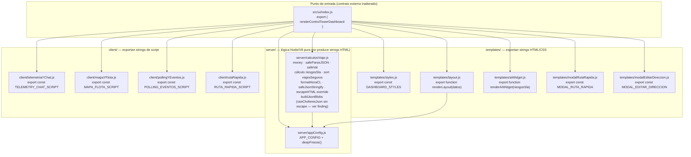
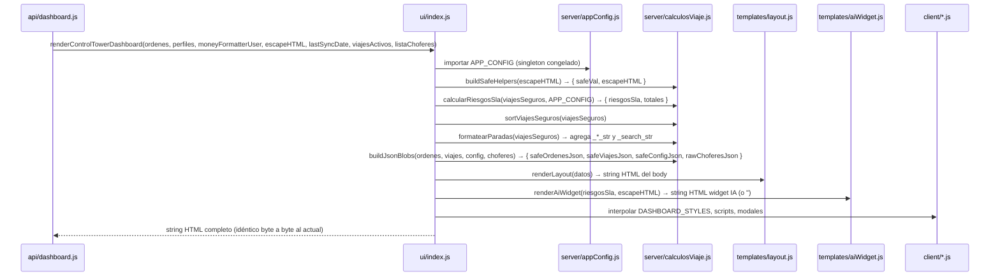
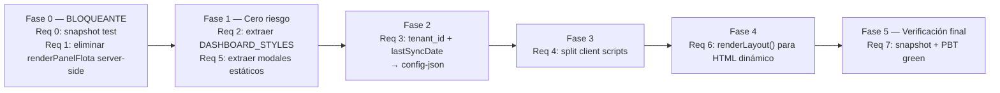
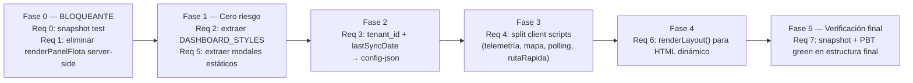

# Design Document: Modularización UI — Torre de Control

## Overview

`src/ui.js` es un módulo monolítico de ~2.500 líneas que genera el HTML completo de la Torre de Control dentro de un único template literal de la función exportada `renderControlTowerDashboard()`. El objetivo del refactor es extraer partes independientes a módulos cohesivos sin cambiar ni un byte del output HTML/CSS/JS resultante.

La decisión arquitectónica central es la más conservadora posible: **todos los módulos nuevos son exportadores de strings**, no ejecutores. `ui/index.js` los importa y los concatena en el mismo orden y posición que hoy. El runtime es Cloudflare Worker V8 — sin DOM, sin `fs`, sin `require()` — por lo que no existe ningún bundler ni Asset Binding de Wrangler: los scripts cliente continúan siendo strings interpolados dentro de etiquetas `<script>`.

### Decisiones de arquitectura clave

| Decisión | Alternativa descartada | Razón |
|---|---|---|
| Módulos exportan strings, no ejecutan lógica | Separar en archivos `.html` / `.css` estáticos con Assets Binding | Assets Binding requiere cambio de infraestructura Wrangler; los strings son transparentes para el runtime V8 |
| `renderPanelFlota` server-side se elimina (Fase 0) | Migrarla | Es código muerto confirmado: nunca se invoca desde el template. Solo existe `window.renderPanelFlota` (client-side), que queda intacta |
| Un único `ui/index.js` como punto de entrada | Refactorizar todos los imports del worker a la vez | Mantiene el contrato externo `import { renderControlTowerDashboard } from './ui.js'` inalterado durante todas las fases |
| `tenant_id` y `lastSyncDate` se mueven al config-json existente (Fase 2) | Inyectarlos como nuevas variables `window._*` | El `<script id="config-json">` ya existe y ya es parseado por el cliente; extenderlo no agrega surface de ataque |
| Los dos `<script>` originales se fusionan en uno; `chatOffcanvas` se mueve antes (Fase 3) | Mantener dos `<script>` y exportar dos constantes de `pollingYEventos.js` | No hay dependencia funcional que justifique la separación. La fusión permite un único `POLLING_EVENTOS_SCRIPT` coherente según el design, sin exports parciales artificiales |
| Refactor en 6 fases con snapshot verde por fase | Big bang en una sola PR | Cualquier regresión se aísla en la fase responsable; el rollback es siempre `git revert` de un commit |


---

## Architecture

### Estructura de módulos



### Flujo de datos: del input al HTML



### Variables calculadas que fluyen del servidor al template

| Variable | Producida en | Consumida en |
|---|---|---|
| `riesgosSla[]` | `calcularRiesgosSla` | `aiWidget.js` (condicional) |
| `totalDineroEnCalle` | `calcularRiesgosSla` | `layout.js` (KPI) |
| `totalDineroRiesgo` | `calcularRiesgosSla` | `layout.js` (KPI) |
| `otifProyectado` | `calcularRiesgosSla` | `layout.js` (KPI) |
| `viajesSeguros[].{_multa_calculada, _riesgo_dinamico}` | `calcularRiesgosSla` | `layout.js` (cards) |
| `viajesSeguros[].{_*_str, _search_str}` | `formatearParadas` | `layout.js` (cards) |
| `safeOrdenesJson`, `safeViajesJson`, `safeConfigJson`, `rawChoferesJson` | `buildJsonBlobs` | `layout.js` (`<script id="*-json">`) |
| `safeVal`, `escapeHTML` (override) | `buildSafeHelpers` | `layout.js`, `aiWidget.js` |

### Fases de ejecución



---

## Components and Interfaces

### `src/ui/index.js`
**Responsabilidad:** Punto de entrada único. Reexporta `renderControlTowerDashboard` con la misma firma que hoy. Importa todos los submódulos y los compone en el mismo orden que el template literal original.

**Exports:** `renderControlTowerDashboard(ordenes, perfiles, moneyFormatterUser, escapeHTML, lastSyncDate, viajesActivos, listaChoferes)`

**Dependencias:** todos los módulos internos de `src/ui/`

---

### `server/appConfig.js`
**Responsabilidad:** Define y exporta `APP_CONFIG` (constantes de bodega, estados operacionales y colores UI) congelado con `deepFreeze`. Es la única fuente de verdad de magic strings para el servidor.

**Exports:** `APP_CONFIG`, `deepFreeze`

**Dependencias:** ninguna

---

### `server/calculosViaje.js`
**Responsabilidad:** Contiene toda la lógica de cálculo server-side que transforma los datos crudos antes de pasarlos a los templates:
- `money(val, moneyFormatterUser)` — formateo de moneda con fallback
- `safeParseJSON(data, fallback)` — parseo defensivo de strings JSON
- `buildSafeHelpers(escapeHTML)` — produce `{ safeVal, escapeHTML }` con el override de backticks/`${}`
- `calcularRiesgosSla(viajesSeguros, APP_CONFIG)` — acumula `riesgosSla[]`, `totalDineroEnCalle`, `totalDineroRiesgo`, `_multa_calculada`, `_riesgo_dinamico`
- `sortViajesSeguros(viajesSeguros)` — ordenamiento por riesgo/valor/trip_id
- `formatearParadas(viajesSeguros)` — agrega `_fecha_sla_str`, `_hora_real_str`, `_eta_str`, `_search_str`
- `buildJsonBlobs(ordenes, viajes, config, choferes)` — produce `{ safeOrdenesJson, safeViajesJson, safeConfigJson, rawChoferesJson }` con `safeJsonStringify` para los primeros tres y `JSON.stringify` crudo para choferes (ver nota de comportamiento preservado abajo)
- `safeJsonStringify(data)` — `JSON.stringify` con escape de `<` y `>`
- `formatHoraCL(fecha)` — formatea hora con `Intl.DateTimeFormat` zona `America/Santiago`

> **Nota — `rawChoferesJson` usa `JSON.stringify` crudo, no `safeJsonStringify`:**
> En `src/ui.js` línea 745 el bloque `<script id="choferes-json">` se genera hoy con `${JSON.stringify(listaChoferes)}` sin escape de `<`/`>`. Este refactor preserva ese comportamiento exacto para mantener el output byte-idéntico. No es un descuido: es intencional.
> **Finding de seguridad abierto (fuera del alcance de este refactor):** `choferes-json` no está sanitizado contra breakout de `</script>`. Si un `nombre_completo` o `chofer_id` en la BD contiene `</script>`, podría romper el tag. Evaluar aplicar `safeJsonStringify` en un spec de seguridad separado.

**Exports:** todas las funciones anteriores

**Dependencias:** `server/appConfig.js`

---

### `templates/styles.js`
**Responsabilidad:** Exporta el bloque CSS completo del dashboard como una string template. No recibe parámetros; el CSS es completamente estático.

**Exports:** `DASHBOARD_STYLES` (string con el contenido del `<style>` actual, sin la etiqueta)

**Dependencias:** ninguna

---

### `templates/layout.js`
**Responsabilidad:** Genera el HTML dinámico del body completo: `<header>`, sidebar con KPIs, tabs, panel flota con cards de viaje, panel backlog, y `<main>` del mapa. Recibe un objeto `datos` con todos los valores ya calculados por `calculosViaje.js`.

**Interface del parámetro `datos`:**
```javascript
{
  money,            // función de formateo
  escapeHTML,       // función de sanitización (con override aplicado)
  safeVal,          // función de sanitización para template literals
  viajesSeguros,    // array procesado (con _multa_calculada, _riesgo_dinamico, etc.)
  ordenesPendientes,// array filtrado
  perfilesSeguros,  // array de perfiles de ruteo
  listaChoferes,    // array de choferes
  totalDineroEnCalle,
  totalDineroRiesgo,
  otifProyectado,
  safeOrdenesJson,
  safeViajesJson,
  safeConfigJson,
  rawChoferesJson,  // JSON.stringify crudo — preserva comportamiento actual (ui.js línea 745)
  lastSyncDate,
  tenantId          // primer tenant_id de ordenes (Fase 2: viene del config-json)
}
```

**Exports:** `renderLayout(datos)` → string HTML

**Dependencias:** `server/appConfig.js` (para `APP_CONFIG.ESTADOS`)

---

### `templates/aiWidget.js`
**Responsabilidad:** Genera el HTML del widget flotante de IA. Aparece **si y solo si** `riesgosSla.length > 0`. Esta condición ternaria no se puede alterar (Propiedad de Corrección #4).

**Exports:** `renderAiWidget(riesgosSla, escapeHTML)` → string HTML o string vacía

**Dependencias:** ninguna

---

### `templates/modalRutaRapida.js`
**Responsabilidad:** Exporta el HTML estático del modal de Ruta Rápida. No depende de datos del servidor.

**Exports:** `MODAL_RUTA_RAPIDA` (string HTML del modal completo)

**Dependencias:** ninguna

---

### `templates/modalEditarDireccion.js`
**Responsabilidad:** Exporta el HTML estático del modal de edición de dirección para paradas SPOT-.

**Exports:** `MODAL_EDITAR_DIRECCION` (string HTML del modal)

**Dependencias:** ninguna

---

### `client/telemetriaYChat.js`
**Responsabilidad:** Exporta la string del script cliente que contiene:
- `escapeHTMLFront(text)` — sanitización client-side
- `formatHoraCL(fecha)` — duplicado client-side para usar en `renderMensajesChat`
- `window.renderMensajesChat(mensajes)` — renderiza historial del chat
- `window.enviarMensajeChat()` — POST al endpoint de chat
- `window.abrirChat(btn)` — abre el offcanvas y arranca el polling de mensajes
- `window.actualizarMensajesSilencioso(tripId)`
- `window.generarEnlacePublico(btn)` — genera y copia el enlace de ruta pública

**Exports:** `TELEMETRY_CHAT_SCRIPT` (string)

**Dependencias:** ninguna (se ejecuta en el cliente)

---

### `client/mapaYFlota.js`
**Responsabilidad:** Exporta la string del script cliente que contiene:
- Parseo del `<script id="config-json">` y `<script id="ordenes-json">` al arranque
- `initMap()` — inicializa Leaflet, marca bodega y backlog
- `dibujarRutaEnMapa(safeTripId)` — dibuja polilínea OSRM con caché y AbortController
- `rastrearFlotaEnVivo()` — polling GPS y actualización de `truckMarkers`
- Declaración de `truckMarkers`, `mapLayersCache`, `mapBoundsCache`, `layerViajeActivo`

**Exports:** `MAPA_FLOTA_SCRIPT` (string)

**Dependencias:** ninguna (depende de Leaflet.js cargado previamente en el HTML)

---

### `client/pollingYEventos.js`
**Responsabilidad:** Exporta la string del script cliente que contiene:
- `window._TENANT_ID` y `window._listaChoferes` — inicialización desde config-json y choferes-json
- `formatHoraCL` (client-side) y `_TIME_CL` — duplicados para uso en `renderMensajesChat`
- `window.renderPanelFlota` (client-side) — re-renderiza el panel de flota sin reload
- `appState` (Proxy reactivo con `activeTripId`, `activeTab`, `searchTerm`)
- `actualizarUI(propiedad, valor)` — renderizado reactivo del DOM
- `actualizarViajesSilencioso()` — live polling cada 5s con guard `document.hidden`
- `DOMContentLoaded` listener — orquesta `initMap`, GPS timer, polling, tabs, búsqueda, asignación de chofer, control GPS remoto, listener `btnSync`, `btnOptimize`, widget IA

**Exports:** `POLLING_EVENTOS_SCRIPT` (string, único export)

**Dependencias:** ninguna (consume `window.renderPanelFlota`, `window.viajesActivos`, etc. definidos en el mismo scope de cliente)

> **Nota arquitectónica — fusión de los dos `<script>` originales (decisión Fase 3):**
> El archivo `ui.js` original tenía dos etiquetas `<script>` separadas por el HTML del `<div id="chatOffcanvas">`. Se analizó si la separación tenía razón funcional: no la tiene. El Script #1 original solo referencia `document.getElementById('choferes-json')`, que existe antes de ambos scripts. El chatOffcanvas no crea dependencia de ejecución entre ellos.
>
> **Decisión adoptada:** en Fase 3 se fusionan los dos `<script>` en uno solo. El `<div id="chatOffcanvas">` se mueve antes del `<script>` único. Esto permite que `pollingYEventos.js` exporte un único `POLLING_EVENTOS_SCRIPT` coherente (Script #1 + appState/actualizarUI + DOMContentLoaded), en lugar de requerir dos exports separados que se repartirían entre dos etiquetas. El comportamiento del browser es idéntico — la fusión solo cambia el orden de aparición en el HTML, no la semántica de ejecución.
>
> **Estructura HTML resultante:**
> ```html
> <script id="ordenes-json">...</script>
> <script id="viajes-json">...</script>
> <script id="config-json">...</script>
> <script id="choferes-json">...</script>
>
> <div id="chatOffcanvas" class="chat-panel">...</div>  <!-- movido antes del script único -->
>
> <script>
>   ${TELEMETRY_CHAT_SCRIPT}
>   ${MAPA_FLOTA_SCRIPT}
>   ${POLLING_EVENTOS_SCRIPT}
>   ${RUTA_RAPIDA_SCRIPT}
> </script>
> ```
>
> **Impacto en snapshot:** el reordenamiento del HTML cambia el snapshot. Se actualiza deliberadamente al final de Fase 3 con `-u`, igual que en Fase 2.

---

### `client/rutaRapida.js`
**Responsabilidad:** Exporta la string del script cliente que contiene:
- `window.abrirRutaRapida()` — abre modal y pausa polling
- `window.cerrarRutaRapida()` — cierra modal y reanuda polling
- `window.agregarParadaRR()` — agrega fila de parada al formulario
- `window.renumerarParadas()` — reordena labels tras eliminar una parada
- `window.validarDireccionesRR()` — geocodificación con Nominatim (rate-limited)
- `window.guardarRutaRapida()` — POST a `/api/ruta-rapida`
- `window.handleCancelSpot(btn)` — cancela viaje SPOT-
- `window.handleEditDir(btn)` — abre modal de edición de dirección
- `window.guardarNuevaDireccion()` — guarda nueva dirección de parada SPOT-

**Exports:** `RUTA_RAPIDA_SCRIPT` (string)

**Dependencias:** ninguna (funciona con el DOM del modal que inyecta `modalRutaRapida.js`)


---

## Data Models

### Parámetros de entrada de `renderControlTowerDashboard`

| Parámetro | Tipo | Descripción |
|---|---|---|
| `ordenes` | `Array<Orden>` | Órdenes pendientes de Supabase (`ordenes_pendientes`) |
| `perfiles` | `Array<Perfil>` | Perfiles de optimización (`perfiles_optimizacion`) |
| `moneyFormatterUser` | `Function\|null` | Formateador de moneda inyectado; fallback a CLP si null |
| `escapeHTML` | `Function` | Sanitizador HTML inyectado; se redefine localmente para agregar escape de backticks |
| `lastSyncDate` | `string\|null` | Timestamp del último sync de Excel |
| `viajesActivos` | `Array<Viaje>` | Viajes activos con `detalle_paradas` embebido |
| `listaChoferes` | `Array<Chofer>` | Choferes disponibles para el selector de asignación |

### Objeto `datos` que recibe `renderLayout()`

```javascript
{
  money,              // Function — formateo de moneda
  escapeHTML,         // Function — sanitización con override de backticks
  safeVal,            // Function — escape de backticks y ${ para template literals
  viajesSeguros,      // Array<Viaje> — con _multa_calculada, _riesgo_dinamico, _*_str
  ordenesPendientes,  // Array<Orden> — filtradas: sin trip_id y en estado PENDIENTE
  perfilesSeguros,    // Array<Perfil>
  listaChoferes,      // Array<Chofer>
  totalDineroEnCalle, // number
  totalDineroRiesgo,  // number
  otifProyectado,     // number (0-100)
  safeOrdenesJson,    // string — JSON escapado para <script id="ordenes-json">
  safeViajesJson,     // string — JSON escapado para <script id="viajes-json">
  safeConfigJson,     // string — JSON escapado para <script id="config-json">
  rawChoferesJson,    // string — JSON.stringify crudo para <script id="choferes-json">
                      // ⚠ Intencionalmente sin safeJsonStringify — preserva comportamiento
                      //   actual (ui.js línea 745). Ver finding de seguridad en calculosViaje.js.
  lastSyncDate,       // string|null
  tenantId            // string — origen: ordenes[0]?.tenant_id || 'empresa_base'
}
```

### Campos calculados que se agregan a los viajes durante el procesamiento server-side

| Campo | Tipo | Descripción |
|---|---|---|
| `v._multa_calculada` | `number` | Suma de multas (10% del monto) de paradas atrasadas |
| `v._riesgo_dinamico` | `number` | Conteo de paradas con `eta > fecha_hora_sla` y no entregadas |
| `p._fecha_sla_str` | `string` | `fecha_hora_sla` formateada en hora CL (`HH:MM`) |
| `p._hora_real_str` | `string` | `hora_real` formateada en hora CL |
| `p._eta_str` | `string` | `eta` formateada en hora CL |
| `p._search_str` | `string` | `"${ot_id} ${cliente}".toLowerCase()` para búsqueda client-side |
| `v._search_str` | `string` | Concatenación de `trip_id`, `chofer` y las `_search_str` de paradas |

---

## Error Handling

### Principio de degradación elegante (heredado de kiro_rules.md)

Todos los módulos siguen el mismo patrón defensivo del monolito original:

- **`safeParseJSON(data, fallback)`**: nunca lanza, retorna `fallback` si el parseo falla
- **`money(val)`**: wrap en try/catch, retorna `'$0'` en caso de error
- **`formatHoraCL(fecha)`**: retorna `'--:--'` si la fecha es inválida
- **Arrays defensivos**: `viajesActivos || []`, `ordenes || []`, `v.detalle_paradas || []`

### Restricciones absolutas de todos los módulos

- Sin `window.location.reload()` — prohibido en cualquier módulo nuevo
- Sin `require()` ni `import()` dinámico — solo ESM estático (runtime V8 de Cloudflare Workers)
- `escapeHTML` override obligatorio antes de cualquier interpolación de datos externos
- `tenant_id` siempre proviene de `ordenes[0]?.tenant_id || 'empresa_base'` — nunca hardcodeado

### Excepción documentada: pollingYEventos.js supera el límite de ~500 líneas

El Req 7 del spec establece que ningún archivo nuevo debería superar ~500 líneas. `pollingYEventos.js` tiene **787 líneas** en la implementación final. Esta excepción fue evaluada explícitamente en Fase 5 y se decidió **no subdividir** por las siguientes razones:

1. **Acoplamiento real, no artificial:** El módulo contiene tres partes que se referencian directamente entre sí: `window.renderPanelFlota` (usa `formatHoraCL`), `appState` (llama `actualizarUI` en su `set` handler), `actualizarUI` (llama `dibujarRutaEnMapa` de `mapaYFlota.js`), y `actualizarViajesSilencioso` (usa `appState.activeTripId`). Subdividir estas partes en módulos separados requeriría exportar y re-importar variables de estado mutable (`appState`) entre módulos que se ejecutan en el mismo scope del browser, lo que rompe el modelo mental actual.

2. **El hoisting ya resuelve el orden:** `actualizarUI` es una `function declaration` y hoistea, por lo que `appState` puede referenciarla antes de que aparezca en el texto. Pero mover `appState` a un módulo separado que importa `actualizarUI` de otro módulo cliente requeriría que ambos módulos tengan un mecanismo de compartir estado, que no existe en el modelo actual de "strings concatenados en un `<script>`".

3. **El límite de ~500 líneas es una guía, no un invariante de corrección.** La restricción dura es que el texto visible del HTML generado sea idéntico (verificado con PBT y comparación carácter a carácter). El conteo de líneas no afecta el comportamiento.

**Si en el futuro se quiere subdividir `pollingYEventos.js`,** el camino correcto es: (a) separar `renderPanelFlota` + `formatHoraCL` en un módulo `panelFlota.js`, y (b) el DOMContentLoaded completo en `eventListeners.js`, aceptando que el output del `<script>` va a cambiar (nuevo snapshot). Eso requiere un spec de refactor propio, no se debe hacer como "arreglo" sin entender por qué quedó así.

---

El cliente recibe los datos del servidor a través de etiquetas `<script type="application/json">` ya existentes en el HTML. No se introduce ningún mecanismo nuevo.

```html
<!-- Bloque ya existente — Fase 0/1/2/3 no lo tocan hasta Fase 2 -->
<script id="ordenes-json" type="application/json">${safeOrdenesJson}</script>
<script id="viajes-json"  type="application/json">${safeViajesJson}</script>
<script id="config-json"  type="application/json">${safeConfigJson}</script>
<script id="choferes-json" type="application/json">${...choferes}</script>
```

El cliente los parsea al arranque:
```javascript
const CONFIG     = JSON.parse(document.getElementById('config-json').textContent);
const ordenesData = JSON.parse(document.getElementById('ordenes-json').textContent);
const viajesData  = JSON.parse(document.getElementById('viajes-json').textContent);
```

### Fase 2: migración de `tenant_id` y `lastSyncDate` al config-json

Hoy `tenant_id` se inyecta como `window._TENANT_ID = '${escapeHTML(...)}'` — una interpolación directa en un inline script — y `lastSyncDate` se interpola en dos lugares del script de eventos.

Tras la Fase 2, ambos valores pasan a ser propiedades del objeto serializado dentro de `<script id="config-json">`. El cliente los lee como `CONFIG.tenant_id` y `CONFIG.last_sync_date`. La línea `window._TENANT_ID = ...` se reemplaza por:

```javascript
window._TENANT_ID = CONFIG.tenant_id || 'empresa_base';
```

Esto elimina dos interpolaciones directas de datos del usuario en template literals, reduciendo la superficie de escape. La validación multi-tenant en el servidor (`ordenes[0]?.tenant_id`) no cambia.


---

## Testing Strategy

### Snapshot test (Fase 0 — bloqueante)

Antes de mover una sola línea de código, se fija el output HTML de referencia como snapshot. Es el contrato de corrección de todo el refactor.

**Archivo:** `src/ui.test.js` (Vitest ya configurado)

**Fixture:** un objeto `inputFixture` con `ordenes`, `viajesActivos` y `listaChoferes` representativos (incluyendo casos con riesgo SLA activo y con `riesgosSla` vacío para ejercitar ambas ramas del widget IA).

**Test:**
```javascript
import { renderControlTowerDashboard } from './ui.js';

it('snapshot — output byte-idéntico', () => {
  const html = renderControlTowerDashboard(...inputFixture);
  expect(html).toMatchSnapshot();
});
```

Al final de cada fase se ejecuta este test. El snapshot existente **no se actualiza** salvo que el cambio sea deliberado y revisado. Si el snapshot falla, la fase hace rollback antes de commitear.

---

### Property-Based Tests (PBT)

Usando **fast-check** (compatible con Vitest). Se verifican las cuatro propiedades de corrección identificadas en los requirements.

#### Propiedad 1 — Idempotencia de output

```javascript
import fc from 'fast-check';

it('PBT: idempotencia — mismo input produce mismo output', () => {
  fc.assert(
    fc.property(arbitraryValidInput(), (input) => {
      const html1 = renderControlTowerDashboard(...input);
      const html2 = renderControlTowerDashboard(...input);
      return html1 === html2;
    })
  );
});
```

**Qué verifica:** el refactor no introduce estado mutable entre llamadas (p.ej., mutaciones de los arrays de entrada que persistan entre invocaciones).

#### Propiedad 2 — Integridad de sanitización

```javascript
it('PBT: ningún backtick ni ${ crudo en el output', () => {
  fc.assert(
    fc.property(arbitraryStringWithSpecialChars(), (maliciousStr) => {
      const input = buildInputWithString(maliciousStr); // inyecta en cliente, ot_id y chofer
      const html = renderControlTowerDashboard(...input);
      // Los valores deben aparecer escapados, nunca crudos
      return !html.includes('`' + maliciousStr) && !html.includes('${' + maliciousStr);
    })
  );
});
```

**Qué verifica:** `safeVal` y el `escapeHTML` override funcionan para cualquier string arbitraria con backticks y `${`.

#### Propiedad 3 — Conservación del config-json

```javascript
it('PBT: config-json es JSON válido con las claves requeridas', () => {
  fc.assert(
    fc.property(arbitraryValidInput(), (input) => {
      const html = renderControlTowerDashboard(...input);
      const match = html.match(/<script id="config-json"[^>]*>([\s\S]*?)<\/script>/);
      if (!match) return false;
      const obj = JSON.parse(match[1]); // lanza si no es JSON válido
      return 'BODEGA' in obj && 'ESTADOS' in obj && 'UI' in obj;
    })
  );
});
```

**Qué verifica:** el bloque `<script id="config-json">` siempre contiene JSON parseable con las claves originales. Tras la Fase 2 se extiende para verificar `tenant_id` y `last_sync_date`.

#### Propiedad 4 — Preservación del widget de IA

```javascript
it('PBT: widget IA aparece sii riesgosSla.length > 0', () => {
  fc.assert(
    fc.property(arbitraryValidInput(), (input) => {
      const html = renderControlTowerDashboard(...input);
      const tieneWidget = html.includes('id="ai-copilot-widget"');
      // calcular riesgosSla localmente para comparar
      const riesgos = calcularRiesgosSlaTest(input[5] /* viajesActivos */);
      const deberiaAparecer = riesgos.length > 0;
      return tieneWidget === deberiaAparecer;
    })
  );
});
```

**Qué verifica:** la condición ternaria `riesgosSla.length > 0` no se altera en ninguna fase del refactor.


---

## Orden de fases y criterio de rollback

Cada fase es un commit independiente. El criterio de "fase completa" es siempre: **snapshot test en verde + PBT en verde**.



### Criterio de rollback por fase

| Fase | Gatillo de rollback | Acción |
|---|---|---|
| **Fase 0** | Snapshot falla al ejecutar con los datos reales de fixture | No continuar: el monolito tiene una diferencia no identificada aún. Investigar antes de proceder. |
| **Fase 1** | Snapshot falla después de extraer CSS o modales | `git revert` del commit de Fase 1. El CSS extraído tiene una diferencia de whitespace o el string de cierre de etiqueta cambió. |
| **Fase 2** | Snapshot falla o `config-json` pierde claves tras mover `tenant_id` | `git revert` Fase 2. Verificar que `buildJsonBlobs` incluye las nuevas claves antes del `JSON.stringify`. |
| **Fase 3** | Snapshot falla o los PBT detectan escapes incorrectos en los scripts de cliente | `git revert` Fase 3. Los scripts cliente contienen backticks o `${` que conflictúan con el template literal del servidor; usar concatenación de strings o escape manual. |
| **Fase 4** | Snapshot falla en `renderLayout()` | `git revert` Fase 4. Revisar que todos los parámetros del objeto `datos` se pasan correctamente y que no hay interpolaciones faltantes en los KPIs o en el panel de flota. |
| **Fase 5** | Algún PBT falla con un contraejemplo real | Identificar qué propiedad viola el contraejemplo, corregir en la fase responsable. No se libera la feature hasta que todos los PBT pasen. |

### Restricciones absolutas que aplican en todas las fases

- **Sin `window.location.reload()`**: prohibido en cualquier módulo nuevo
- **`escapeHTML` override obligatorio**: `safeVal` y el override de backticks deben aplicarse antes de cualquier interpolación en el template literal principal
- **`tenant_id` con validación multi-tenant intacta**: el origen siempre es `ordenes[0]?.tenant_id || 'empresa_base'`, nunca un valor hardcoded
- **Sin DELETE ni lógica de negocio nueva**: los módulos solo reordenan código existente
- **Sin `require()` ni `import()` dinámico**: el runtime V8 del Worker solo soporta ESM estático


---

## Correctness Properties

Las siguientes propiedades deben mantenerse para **cualquier** input válido de `renderControlTowerDashboard` en todas las fases del refactor y en el estado final.

### Property 1: Idempotencia de output

```
∀ (ordenes, perfiles, moneyFormatterUser, escapeHTML, lastSyncDate, viajesActivos, listaChoferes) válidos:
  renderControlTowerDashboard(args) === renderControlTowerDashboard(args)
```

El refactor no puede introducir estado mutable entre llamadas. Los arrays de entrada no se pueden mutar de forma persistente (`_multa_calculada`, etc. se deben computar en cada invocación, no en un caché externo).

**Validates: Requirements 0, 7**

### Property 2: Integridad de sanitización

```
∀ s ∈ String que provenga de ordenes[i].{cliente, ot_id, trip_id, ...} o viajesActivos[j].{...}:
  aparecer_en_HTML(s) ⟹ escapeHTML(s) ∨ safeVal(s) fue aplicado
  ∧ ¬ ∃ posición en atributos HTML ni en <script id="*-json"> donde s aparezca crudo con ` o ${
```

**Validates: Requirements 0, 3**

### Property 3: Conservación del config-json

```
∀ input válido:
  sea html = renderControlTowerDashboard(input)
  sea match = html.match(/<script id="config-json"[^>]*>([\s\S]*?)<\/script>/)
  ⟹ match ≠ null
  ∧ JSON.parse(match[1]) no lanza
  ∧ { BODEGA, ESTADOS, UI } ⊆ keys(JSON.parse(match[1]))
  (Fase 2+): ∧ { tenant_id, last_sync_date } ⊆ keys(JSON.parse(match[1]))
```

**Validates: Requirements 0, 3, 7**

### Property 4: Preservación del widget de IA

```
∀ input válido:
  sea html = renderControlTowerDashboard(input)
  sea R = { p ∈ detalle_paradas(viajesActivos) | p.eta > p.fecha_hora_sla ∧ p.estado ≠ ENTREGADO }
  ⟹ (html.includes('id="ai-copilot-widget"') ↔ |R| > 0)
```

La condición ternaria `riesgosSla.length > 0` es invariante y no puede ser refactorizada a una condición diferente ni a un default truthy/falsy.

**Validates: Requirements 0, 6**

